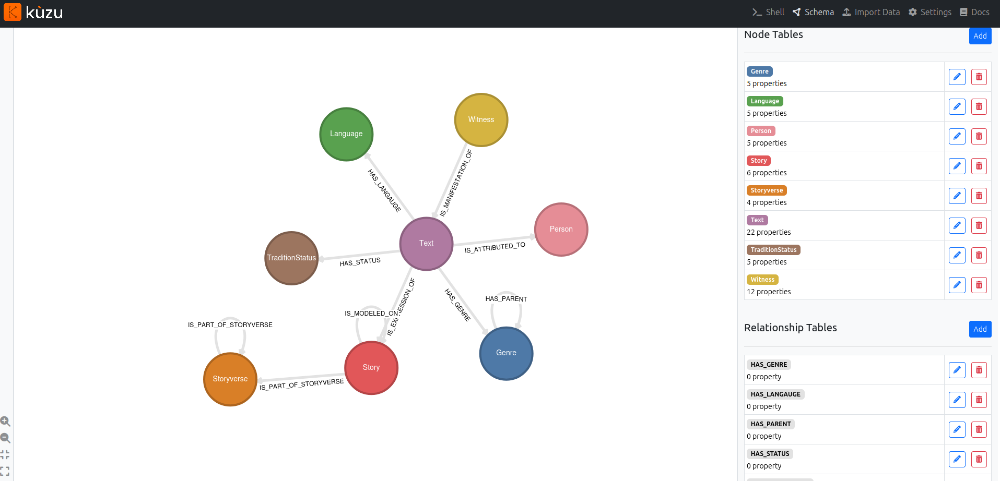
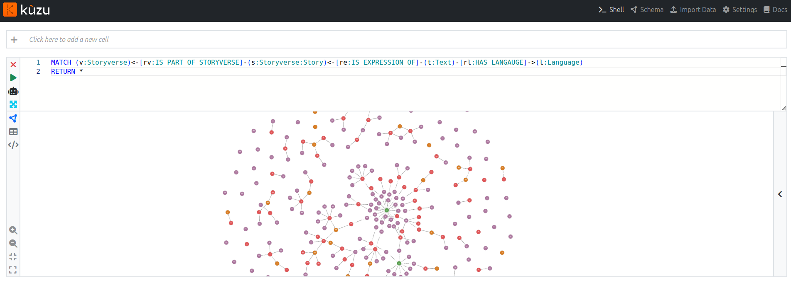

# TEI Depot

In-progress depot for products of LostMa's database.

1. [TEI-XML documents](#tei-xml-documents): [`texts`](./texts/)

    - TEI-XML documents, which represent Texts in the LostMa database, their metadata, and their witnesses.

2. [Graph database](#graph-database): [`kuzu_db`](./kuzu_db/)

    - Graph conversion of LostMa's relational Heurist database, using the embedded, in-process graph database system by [Kùzu](https://kuzudb.com/).

To work with the graph database, you'll need to `git clone` this repository. You should also `git pull` regularly to make sure you're working with the most up-to-date version of the in-progress data.

To simply peruse the TEI-XML files, you can just go to the [directory](./texts/).

## TEI-XML documents

The directory [`texts/`](./texts/) contains subdirectories of TEI-XML documents, organised by language.

When the text was saved with a language, the subdirectory has the name of the ISO code LostMa uses for that language, i.e. [`dum`](./texts/dum/) for Middle Dutch.

If the text was saved without a language, you can find it in the subdirectory [`null/`](./texts/null/).

### Key metadata

At this stage of the project, the following 2 sections are most relevant:

The `sourceDesc` presents the text's title, authors (if available), and a list of its witnesses. In an upcoming phase, the `<witness>` element will have a lot more metadata, but its simple presence at least allows us to count the number of witnesses descending from a text.

```xml
    </fileDesc>
      <titleStmt/>
      <publicationStmt/>
      <sourceDesc>
        <bibl xml:id="text_47548">
          <title type="full">
            <title type="main">Floris ende Blancefloer</title>
          </title>
        </bibl>
        <listWit>
          <witness xml:id="witness_47552"/>
          <witness xml:id="witness_47556"/>
        </listWit>
      </sourceDesc>
    </fileDesc>
```

The `profileDesc` presents the text's creation date, language, and the following classifications: literary form (`scheme=#form`), tradition status (`scheme=#traditionStatus`), genre (`scheme=#genre`).

```xml
    <profileDesc>
      <creation>
        <date notBefore="1226-01-01" notAfter="1325-12-31" cert="conjecture">'Medio en tweede helft dertiende eeuw'</date>
      </creation>
      <langUsage>
        <language ident="dum" ref="https://iso639-3.sil.org/code/dum" xml:id="lang_9728">Middle Dutch</language>
      </langUsage>
      <textClass>
        <catRef scheme="#form" target="#verseForm"/>
        <catRef scheme="#traditionStatus" target="#traditionSurviving"/>
        <catRef scheme="#genre" target="#genre_47474"/>
        <keywords>
          <term>Other</term>
        </keywords>
      </textClass>
    </profileDesc>
```

## Graph database

Visually and intuitively explore the graph, which is saved in the directory [`kuzu_db`](./kuzu_db/), using the browser-based [Kùzu Explorer](https://docs.kuzudb.com/visualization/kuzu-explorer/).

The only requirement is to have [Docker](https://docs.docker.com/desktop/) installed and running in the background. If it's not running, you'll see the following warning:

```console
$ bash ./explorer.sh
docker: Cannot connect to the Docker daemon at unix:///home/user/.docker/desktop/docker.sock. Is the docker daemon running?.
See 'docker run --help'.
```

Finally, with Docker running, enter the following command in a terminal:

```shell
bash ./explorer.sh
```

At [http://localhost:8000](http://localhost:8000/), explore the network's schema (`Schema` tab) and select data from it using the Cypher query language (`>_Shell` tab). For help, see [Kùzu Explorer](https://docs.kuzudb.com/visualization/kuzu-explorer/).

With an OpenAI API key, you can also query the network using natural language (i.e. English), and let Kùzu translate that into the Cypher query language.





Kùzu Explorer is still a little glitchy. For example, dates are not currently parsed correctly. (I've opened an [issue](https://github.com/kuzudb/kuzu/issues/5173) about this with the creators). But the open-source Kùzu project is still relatively new, promising (in my opinion), and being updated regularly with new bug fixes.

In any case, if you're adventurous, load the [`kuzu_db`](./kuzu_db/) database with Kùzu's Python client and play with it from there.

```python
import kuzu

# Make a connection to the database saved at kuzu_db/
db = kuzu.Database("kuzu_db/")
conn = kuzu.Connection(db)

# Return all the texts in a dataframe
query_result = conn.execute("MATCH (t:Text) RETURN t")
df = query_result.get_as_df()
```
